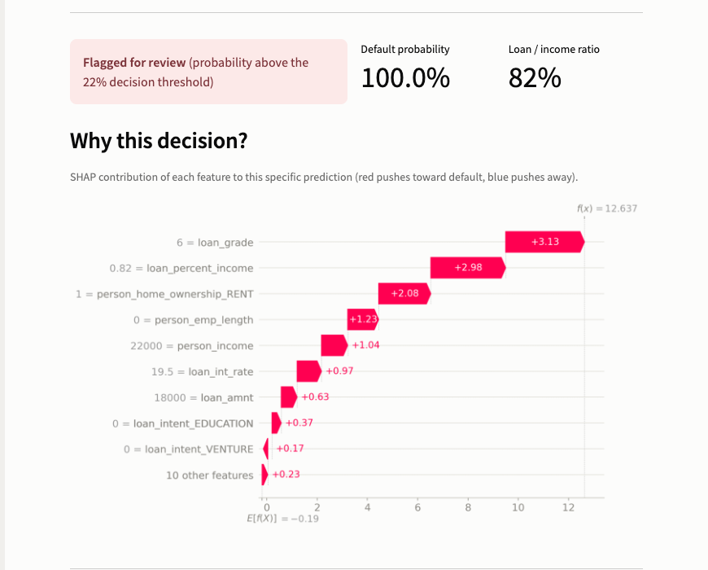
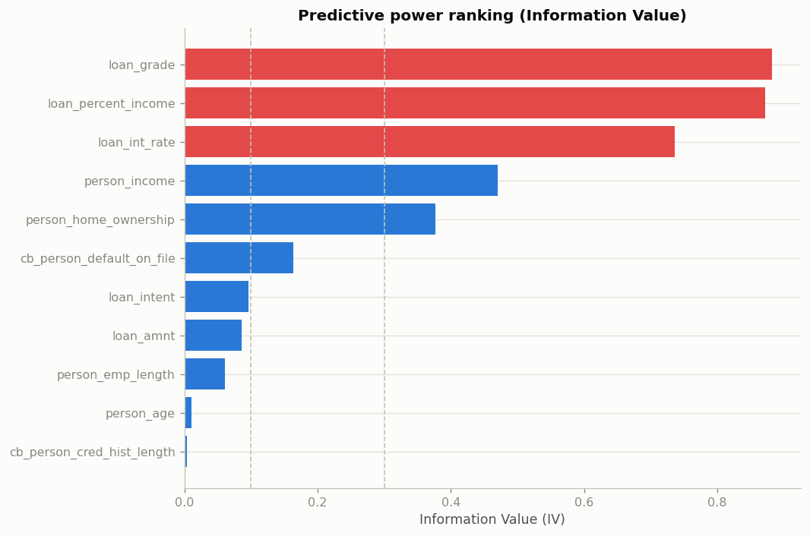
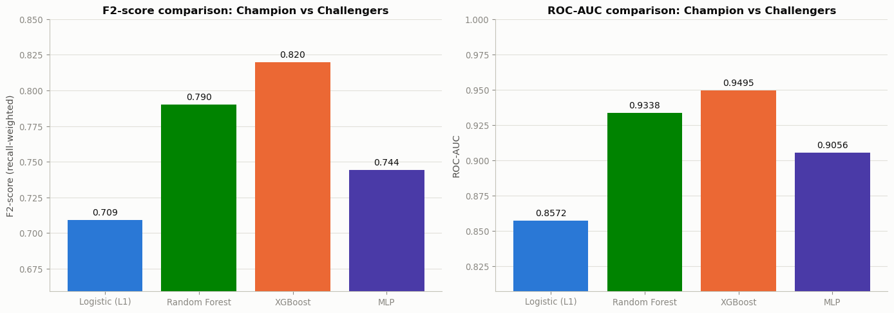
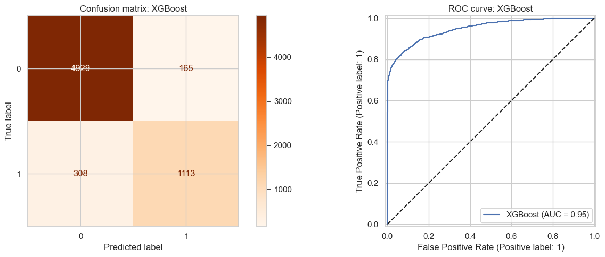
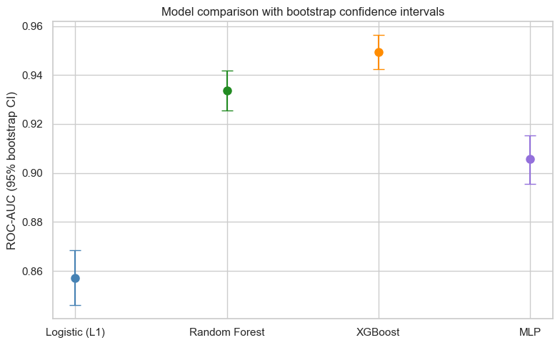
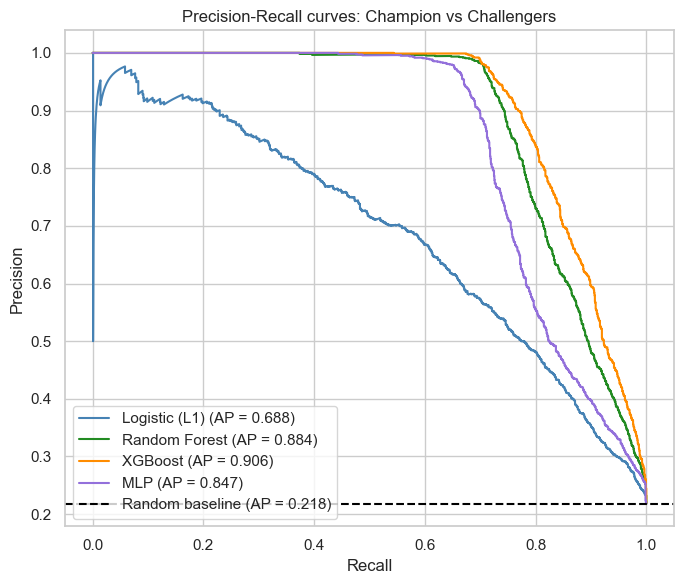
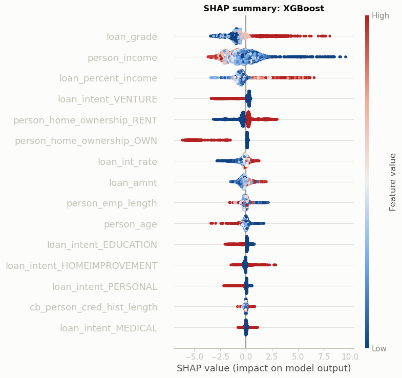

# Credit Risk Modeling: Champion vs Challengers


[](https://credit-risk-classification-fprbidokieelrpbgryxzvz.streamlit.app/)

Binary classification project predicting loan default on 32,581 observations from a real-world lending dataset. A logistic regression **champion** model is benchmarked against three **challengers** (Random Forest, XGBoost, MLP), with the decision threshold tuned via F2-score to reflect the asymmetric cost of missing a default.

**[Try the live demo](https://credit-risk-classification-fprbidokieelrpbgryxzvz.streamlit.app/)**: fill in a loan application and get the XGBoost model's default probability, decision, and a per-applicant SHAP explanation.



**TL;DR**
- Benchmarked 4 models end to end (Logistic L1, Random Forest, XGBoost, MLP) with statistical significance testing, bootstrap confidence intervals, and SHAP explainability, not just a single accuracy number.
- XGBoost wins on every metric (ROC-AUC 0.950, F2 0.820), and its edge over Random Forest holds up under bootstrap resampling rather than being a one-off test-split artifact.
- That edge translates to catching an estimated ~5.5 more defaults per 1,000 applications than the next-best challenger, worth roughly $59K in avoided losses per 1,000 applications (see Results for the full calculation and its assumptions).
- Shipped as an interactive Streamlit demo with per-applicant SHAP explanations, not just static notebook plots.

**Course project by:** Illian Hashatel, [Reda Allab](https://github.com/RedaAllab), Issa Ali Adoum
**Course:** Data Science Software, M2 IRFA, Université Paris 1
**Supervisor:** Bertrand Hassani
**Engineering extensions by Reda Allab:** testing (pytest + CI), bootstrap confidence intervals, Information Value / VIF diagnostics, SHAP explainability, and the visualization system. See the [commit history](https://github.com/RedaAllab/credit-risk-classification/commits/main) for the full breakdown.

---

## EDA highlights

Beyond distributions and missingness, the EDA ranks each feature's predictive power with Weight of Evidence / Information Value, a standard credit-scoring diagnostic. It flags `loan_grade`, `loan_percent_income`, and `loan_int_rate` as the strongest predictors (IV > 0.5), the same three features the modeling stage and SHAP later confirm as most important:



An IV this high is normally a red flag for target leakage, but here it's explainable: `loan_grade` and `loan_int_rate` are underwriting fields set *at* origination to price risk, so they're legitimately available pre-outcome rather than proxies for it. The full notebook also covers formal significance testing (Mann-Whitney U, chi-square) and multicollinearity diagnostics (VIF) for every feature.

---

## Results

| Model | ROC-AUC | F2-score | Default recall |
|---|---|---|---|
| Logistic Regression (L1) | 0.857 | 0.709 | 0.577 |
| Random Forest | 0.934 | 0.790 | 0.702 |
| **XGBoost** | **0.950** | **0.820** | **0.727** |
| MLP | 0.906 | 0.744 | 0.729 |





**Is XGBoost's edge over Random Forest real, or just this particular test split?** A 1,000-resample bootstrap on the test set gives 95% confidence intervals of **[0.9425, 0.9563]** for XGBoost and **[0.9256, 0.9418]** for Random Forest: they don't overlap, so the gap is narrow but statistically real, not sampling noise.



With defaults at only ~22% of the test set, ROC-AUC alone can be optimistic about minority-class performance. The Precision-Recall curves (summarized by Average Precision) confirm the same ranking focused specifically on the default class:



XGBoost is the model we'd deploy, but as a boosted tree ensemble it isn't natively interpretable. SHAP values attribute each prediction to individual feature contributions, showing not just which features matter but in which direction:



**What does XGBoost's recall edge mean in dollar terms?** XGBoost's default recall (0.727) beats Random Forest's (0.702) by 2.5 points. At this dataset's ~22% default rate, that's roughly **5.5 additional defaults caught per 1,000 applications**. At the average defaulted-loan amount in this dataset (**$10,851**), and assuming a simplified 100% loss given default, that puts XGBoost's edge over Random Forest at approximately **$59,000 in avoided losses per 1,000 applications**. The 100% LGD assumption is a deliberately conservative upper bound for illustration, not a real-world loss estimate: actual credit losses are partially recovered through collections, collateral, or settlements (see Limitations).

**Key takeaways**
- XGBoost wins on every metric (ROC-AUC, F2-score, Average Precision), confirming a non-linear relationship between borrower features and default risk, and its advantage over Random Forest holds up under bootstrap resampling.
- Logistic regression stays a solid, natively interpretable baseline (~0.86 ROC-AUC), useful where explainability is a hard requirement.
- The FN/FP cost ratio (~6.7) justifies optimizing for recall on the default class even at the expense of more false positives; F2-score captures this trade-off directly.
- `loan_grade`, `person_income`, and `loan_percent_income` are the dominant drivers of XGBoost's predictions: a worse grade, lower income, or higher debt-to-income ratio all push predictions toward default, consistent with domain intuition.
- **Recommendation:** deploy XGBoost as the primary decision engine, paired with SHAP for per-decision explanations to satisfy GDPR Art. 22 / Basel III transparency requirements on internal credit models.

---

## Repository structure

```
.
├── notebooks/
│   ├── credit_risk_eda.ipynb            # Exploratory data analysis
│   └── credit_risk_modeling_en.ipynb     # Preprocessing, modeling, evaluation
├── src/
│   ├── preprocessing.py                 # Cleaning, encoding, train/test split logic
│   └── evaluation.py                    # Threshold search and diagnostic plots shared across models
├── scripts/
│   ├── train_final_model.py             # Trains and saves the champion model for the demo app
│   ├── train_automl.py                  # Trains a FLAML AutoML challenger (see AutoML challenger below)
│   └── merge_automl_challenger.py       # Folds the AutoML challenger into models/all_models.joblib
├── app/
│   └── streamlit_app.py                 # Interactive demo (see Live demo below)
├── models/
│   └── all_models.joblib                # All 5 trained models, used by the demo app
├── tests/
│   ├── test_preprocessing.py            # Unit tests for src/preprocessing.py
│   ├── test_evaluation.py               # Unit tests for src/evaluation.py
│   └── test_automl.py                   # Smoke test for scripts/train_automl.py
├── reports/
│   └── dss_report_en.pdf                # Full written report
├── data/
│   └── credit_risk_dataset.csv          # Source dataset (Kaggle)
├── assets/                              # Figures used in this README
├── .github/workflows/ci.yml             # Runs the test suite on every push/PR
├── requirements.txt
└── requirements-automl.txt              # Separate environment for scripts/train_automl.py (see below)
```

The notebooks import their preprocessing steps from `src/preprocessing.py` rather than duplicating the logic inline, so the cleaning/encoding pipeline is unit-tested (`pytest tests/`) and reusable outside the notebook.

---

## Methodology

1. **EDA** (`notebooks/credit_risk_eda.ipynb`): distributions, missingness, outliers, target imbalance, statistical significance testing (Mann-Whitney U, chi-square), multicollinearity (VIF), and Information Value ranking.
2. **Preprocessing**: missingness indicators, categorical encoding, train/test split.
3. **Champion model**: L1-regularized logistic regression, chosen for interpretability and its role as a scoring baseline.
4. **Challengers**: Random Forest, XGBoost, and an MLP, compared on ROC-AUC and F2-score.
5. **Threshold optimization**: the decision threshold is tuned to maximize F2-score rather than accuracy, reflecting the higher cost of a missed default vs. a false alarm.
6. **Correlation & importance analysis**: feature correlation structure and per-model feature importance to sanity-check and explain the results.
7. **Statistical robustness**: bootstrap confidence intervals on ROC-AUC and F2-score to check whether ranking differences between models are statistically meaningful.
8. **Precision-Recall analysis**: PR curves and Average Precision, a metric less sensitive to class imbalance than ROC-AUC.
9. **Explainability**: SHAP values for XGBoost, to attribute predictions to individual feature contributions.

## Limitations

This project validates the model on a single held-out split of one static dataset, not a live portfolio. A few gaps would need addressing before any real deployment:
- **No temporal validation**: the train/test split is random, not chronological. Credit risk drifts with macroeconomic conditions, so a true out-of-time split (train on year N, test on year N+1) would give a more realistic estimate of live performance than a random split does.
- **No drift monitoring plan**: a production system would need scheduled recalibration checks and feature-drift monitoring (e.g., Population Stability Index) to catch when the model's assumptions stop holding.
- **Single dataset, single source**: no validation against a second lending dataset or institution, so generalization outside this specific population is untested.
- **The $ impact estimate above is illustrative, not a real loss estimate**: it assumes 100% loss given default for simplicity; real credit losses are partially recovered through collections, collateral, or settlements.

## Live demo

**[credit-risk-classification-fprbidokieelrpbgryxzvz.streamlit.app](https://credit-risk-classification-fprbidokieelrpbgryxzvz.streamlit.app/)**

`app/streamlit_app.py` is a small Streamlit app: fill in a loan application (age, income, loan amount, grade, etc.), or click one of the low-risk / high-risk example profiles, and get the champion XGBoost model's default probability, its decision at the F2-optimized threshold, a SHAP waterfall explaining that specific prediction, and how the 4 challenger models (including the AutoML challenger below) would have scored the same applicant.

Run it locally:

```bash
pip install -r requirements.txt
python scripts/train_final_model.py   # trains and saves models/all_models.joblib once
streamlit run app/streamlit_app.py
```

### AutoML challenger

`scripts/train_automl.py` adds a fifth model to the comparison: a [FLAML](https://microsoft.github.io/FLAML/) AutoML search over LightGBM, Random Forest, Extra Trees, L1/L2-regularized logistic regression, SGD, and SVC, replacing this project's manual GridSearchCV with a time-budgeted search. ("kneighbor"/KNN is excluded: scikit-learn's `KNeighborsClassifier.fit()` doesn't accept `sample_weight`, which this script uses for class-imbalance handling like every other model here, so including it crashes the whole search rather than just skipping that one trial.) It's excluded from the "Results" table above since it isn't part of the graded coursework, but it does appear in the live demo's champion-vs-challengers comparison as **AutoML (FLAML)** (test set: ROC-AUC 0.946, F2 0.816, recall 0.877 - on par with XGBoost's F2 and ROC-AUC, at meaningfully higher recall).

It runs in its own environment (`requirements-automl.txt`), separate from `requirements.txt`: `flaml[automl]` pins `xgboost<3.0`, which conflicts with this project's `xgboost==3.2.0`, so XGBoost is excluded from FLAML's search space and the two environments are never installed together.

```bash
python -m venv .venv-automl && source .venv-automl/bin/activate
pip install -r requirements-automl.txt
python scripts/train_automl.py --time-budget 300      # saves models/automl_challenger.joblib
deactivate

source .venv/bin/activate                              # back in the main requirements.txt environment
python scripts/merge_automl_challenger.py               # folds it into models/all_models.joblib
```

## Setup

```bash
git clone https://github.com/RedaAllab/credit-risk-classification.git
cd credit-risk-classification
pip install -r requirements.txt
```

Run `notebooks/credit_risk_eda.ipynb` and `notebooks/credit_risk_modeling_en.ipynb` top to bottom (paths are relative to `notebooks/`, dataset lives in `data/`).

Run the test suite for the preprocessing pipeline with:

```bash
python -m pytest tests/ -v
```

The dataset is the [Credit Risk Dataset](https://www.kaggle.com/datasets/laotse/credit-risk-dataset) from Kaggle.
